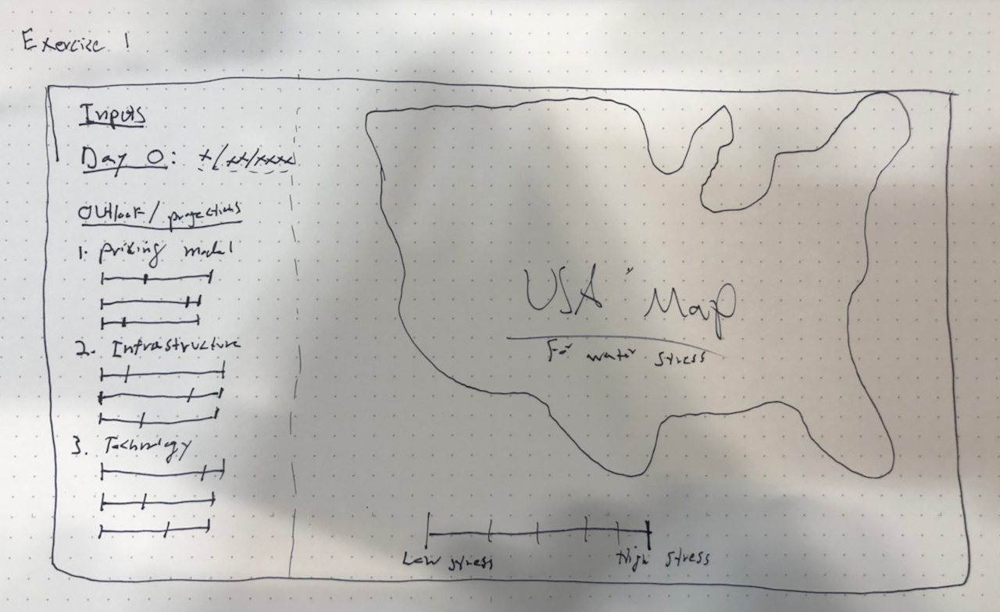

MindMap: https://www.mindmeister.com/1212385590?t=ILMkfizPXO

--

Exercise 1; Part 3—initial concept

- Who is your audience (persona, demographic or professional group, knowledgeable about context)?

  - Policy makers looking for overview and suggestions on water conservation efforts and funding opportunities
  - General public concerned with water inefficiency and safety

- How is your audience reading or encounter your project (media, UI, distribution channel, types of devices, spatial context)?
  - Digital devices: primarily desktop first, mobile and tablet supported
- What does your project ask of your audience to do (input, involvement, user experience)?
  - Some reading to understand the problem (demand for water is increasing and supply is also decreasing)
  - Simulator visualization asks users to adjust inputs and outlook to see model output for water conservation and water stress levels across the country
    - i.e., climate change outlook, water pricing increase, animal product consumption, infrastructure repairs, technological advances, etc.
- What does your audience learn and take away from their user experience?

  - The audience will learn what we need to do as a society to get more usage out of less water:

    1. Price water accurately and reasonably
    1. Rebuild failing infrastructure
    1. Invest in water technology

  - These measures will change our relationship with water and prepare us for a global water "transition" that shifts the geopolitical landscape in the 21st century.

### Initial Sketch Concept

